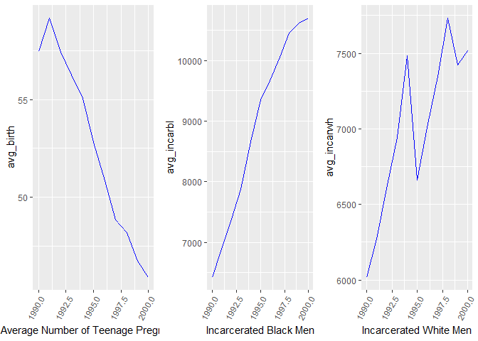
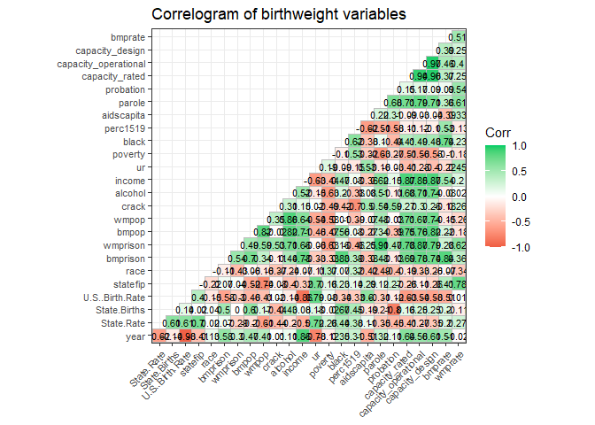
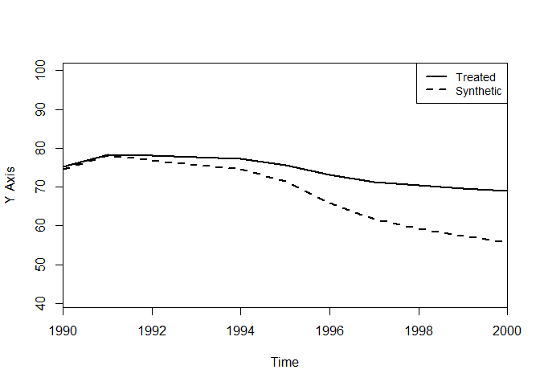
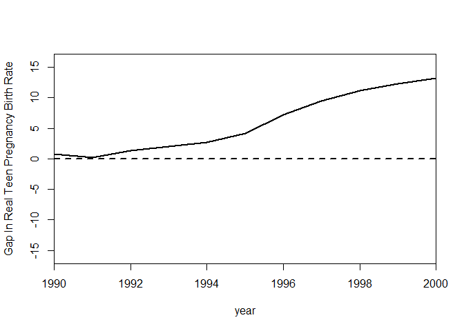
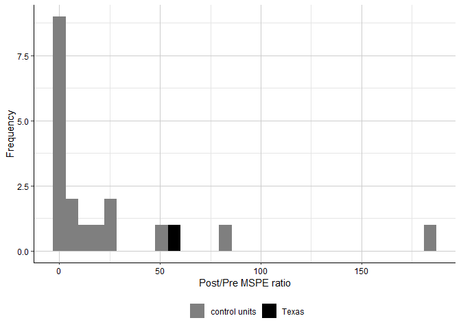

Impact of Texas Prison Expansion On Teen Pregnancy
================
Patrick Chase Anuka Revi
4/21/2021

# **Introduction**

In this project we are looking at the impact of prison expansion on
teenage pregnancy and live birth rate. Specifically , we are focusing on
Texas state prison expansion during 1993 and early 2000 implemented by
governor Ann Richards that tripled the size of the states prison system.
Texas sudden prison boom had a major consequence – state’s prison
population more than doubled in five years. It would be reasonable to
assume that since many young men, especially young black men were
incarcerated, teen fertility would drop due to imbalance in sex ratio.
The goal of this paper is to determine if there is a causal relationship
between the spike of incarceration rate among juveniles and teen
pregnancy and live birth rate. We would expect this relationship to be
negative, in order to evaluate this we are using synthetic controls. The
advantage of using SCM is it looks like the treated case in key metrics
in terms of the prior covariates and other post outcome predictors, thus
it gives us apples to apples comparison.

# **Data Exploration**

We used *Texas.dta* data found in Dr. Scott Cunningham’s textbook
*“Mixtape”*
<https://mixtape.scunning.com/synthetic-control.html?panelset=r-code>
and merged it with teen pregnancy data from CDC.gov.
<https://www.cdc.gov/nchs/data-visualization/teen-births/index.htm> Data
overview is given in the table below. Our variable of interest is teen
pregnancy given by the variable name *“state.Births”* (in absolute
terms) or *“state rate”*(state birth per 1000).

<bk><bk><bk>

<table>

<thead>

<tr>

<th style="text-align:right;">

year

</th>

<th style="text-align:left;">

state

</th>

<th style="text-align:left;">

Age.Group..Years.

</th>

<th style="text-align:right;">

State.Rate

</th>

<th style="text-align:right;">

State.Births

</th>

<th style="text-align:left;">

U.S..Births

</th>

<th style="text-align:right;">

U.S..Birth.Rate

</th>

<th style="text-align:left;">

Unit

</th>

<th style="text-align:right;">

statefip

</th>

<th style="text-align:right;">

race

</th>

<th style="text-align:right;">

bmprison

</th>

<th style="text-align:right;">

wmprison

</th>

<th style="text-align:right;">

bmpop

</th>

<th style="text-align:right;">

wmpop

</th>

<th style="text-align:right;">

error

</th>

<th style="text-align:right;">

crack

</th>

<th style="text-align:right;">

alcohol

</th>

<th style="text-align:right;">

income

</th>

<th style="text-align:right;">

ur

</th>

<th style="text-align:right;">

poverty

</th>

<th style="text-align:right;">

black

</th>

<th style="text-align:right;">

perc1519

</th>

<th style="text-align:right;">

aidscapita

</th>

<th style="text-align:right;">

parole

</th>

<th style="text-align:right;">

probation

</th>

<th style="text-align:right;">

capacity\_rated

</th>

<th style="text-align:right;">

capacity\_operational

</th>

<th style="text-align:right;">

capacity\_design

</th>

<th style="text-align:right;">

bmprate

</th>

<th style="text-align:right;">

wmprate

</th>

</tr>

</thead>

<tbody>

<tr>

<td style="text-align:right;">

1990

</td>

<td style="text-align:left;">

Alabama

</td>

<td style="text-align:left;">

15-19 years

</td>

<td style="text-align:right;">

71.0

</td>

<td style="text-align:right;">

NA

</td>

<td style="text-align:left;">

521,826

</td>

<td style="text-align:right;">

59.9

</td>

<td style="text-align:left;">

per 1,000

</td>

<td style="text-align:right;">

1

</td>

<td style="text-align:right;">

1

</td>

<td style="text-align:right;">

9282.0

</td>

<td style="text-align:right;">

5421

</td>

<td style="text-align:right;">

470480

</td>

<td style="text-align:right;">

1450374

</td>

<td style="text-align:right;">

0

</td>

<td style="text-align:right;">

0.5094361

</td>

<td style="text-align:right;">

1.92

</td>

<td style="text-align:right;">

15723

</td>

<td style="text-align:right;">

6.333334

</td>

<td style="text-align:right;">

19.2

</td>

<td style="text-align:right;">

25.595875

</td>

<td style="text-align:right;">

7.868362

</td>

<td style="text-align:right;">

4.370311

</td>

<td style="text-align:right;">

5970

</td>

<td style="text-align:right;">

27686

</td>

<td style="text-align:right;">

13782

</td>

<td style="text-align:right;">

13782

</td>

<td style="text-align:right;">

13782

</td>

<td style="text-align:right;">

1972.879

</td>

<td style="text-align:right;">

373.7657

</td>

</tr>

<tr>

<td style="text-align:right;">

1990

</td>

<td style="text-align:left;">

Alaska

</td>

<td style="text-align:left;">

15-19 years

</td>

<td style="text-align:right;">

65.3

</td>

<td style="text-align:right;">

NA

</td>

<td style="text-align:left;">

521,826

</td>

<td style="text-align:right;">

59.9

</td>

<td style="text-align:left;">

per 1,000

</td>

<td style="text-align:right;">

2

</td>

<td style="text-align:right;">

2

</td>

<td style="text-align:right;">

288.0

</td>

<td style="text-align:right;">

1390

</td>

<td style="text-align:right;">

12655

</td>

<td style="text-align:right;">

225383

</td>

<td style="text-align:right;">

0

</td>

<td style="text-align:right;">

\-1.1660120

</td>

<td style="text-align:right;">

3.33

</td>

<td style="text-align:right;">

22804

</td>

<td style="text-align:right;">

7.058333

</td>

<td style="text-align:right;">

11.4

</td>

<td style="text-align:right;">

5.036440

</td>

<td style="text-align:right;">

6.837102

</td>

<td style="text-align:right;">

1.807370

</td>

<td style="text-align:right;">

568

</td>

<td style="text-align:right;">

3599

</td>

<td style="text-align:right;">

2808

</td>

<td style="text-align:right;">

NA

</td>

<td style="text-align:right;">

NA

</td>

<td style="text-align:right;">

2275.780

</td>

<td style="text-align:right;">

616.7280

</td>

</tr>

<tr>

<td style="text-align:right;">

1990

</td>

<td style="text-align:left;">

Arizona

</td>

<td style="text-align:left;">

15-19 years

</td>

<td style="text-align:right;">

75.5

</td>

<td style="text-align:right;">

NA

</td>

<td style="text-align:left;">

521,826

</td>

<td style="text-align:right;">

59.9

</td>

<td style="text-align:left;">

per 1,000

</td>

<td style="text-align:right;">

4

</td>

<td style="text-align:right;">

2

</td>

<td style="text-align:right;">

2283.0

</td>

<td style="text-align:right;">

10702

</td>

<td style="text-align:right;">

60199

</td>

<td style="text-align:right;">

1623649

</td>

<td style="text-align:right;">

0

</td>

<td style="text-align:right;">

0.5547590

</td>

<td style="text-align:right;">

2.77

</td>

<td style="text-align:right;">

17005

</td>

<td style="text-align:right;">

5.275000

</td>

<td style="text-align:right;">

13.7

</td>

<td style="text-align:right;">

3.869852

</td>

<td style="text-align:right;">

7.110507

</td>

<td style="text-align:right;">

8.143108

</td>

<td style="text-align:right;">

2711

</td>

<td style="text-align:right;">

30397

</td>

<td style="text-align:right;">

NA

</td>

<td style="text-align:right;">

13884

</td>

<td style="text-align:right;">

NA

</td>

<td style="text-align:right;">

3792.422

</td>

<td style="text-align:right;">

659.1326

</td>

</tr>

<tr>

<td style="text-align:right;">

1990

</td>

<td style="text-align:left;">

Arkansas

</td>

<td style="text-align:left;">

15-19 years

</td>

<td style="text-align:right;">

80.1

</td>

<td style="text-align:right;">

NA

</td>

<td style="text-align:left;">

521,826

</td>

<td style="text-align:right;">

59.9

</td>

<td style="text-align:left;">

per 1,000

</td>

<td style="text-align:right;">

5

</td>

<td style="text-align:right;">

2

</td>

<td style="text-align:right;">

3648.5

</td>

<td style="text-align:right;">

3396

</td>

<td style="text-align:right;">

174238

</td>

<td style="text-align:right;">

948187

</td>

<td style="text-align:right;">

1

</td>

<td style="text-align:right;">

0.7592691

</td>

<td style="text-align:right;">

1.86

</td>

<td style="text-align:right;">

14460

</td>

<td style="text-align:right;">

6.750000

</td>

<td style="text-align:right;">

19.6

</td>

<td style="text-align:right;">

16.173077

</td>

<td style="text-align:right;">

7.611859

</td>

<td style="text-align:right;">

3.182570

</td>

<td style="text-align:right;">

3971

</td>

<td style="text-align:right;">

15983

</td>

<td style="text-align:right;">

NA

</td>

<td style="text-align:right;">

6535

</td>

<td style="text-align:right;">

NA

</td>

<td style="text-align:right;">

2093.975

</td>

<td style="text-align:right;">

358.1572

</td>

</tr>

<tr>

<td style="text-align:right;">

1990

</td>

<td style="text-align:left;">

California

</td>

<td style="text-align:left;">

15-19 years

</td>

<td style="text-align:right;">

70.6

</td>

<td style="text-align:right;">

NA

</td>

<td style="text-align:left;">

521,826

</td>

<td style="text-align:right;">

59.9

</td>

<td style="text-align:left;">

per 1,000

</td>

<td style="text-align:right;">

6

</td>

<td style="text-align:right;">

2

</td>

<td style="text-align:right;">

32190.0

</td>

<td style="text-align:right;">

54409

</td>

<td style="text-align:right;">

1151823

</td>

<td style="text-align:right;">

12224777

</td>

<td style="text-align:right;">

0

</td>

<td style="text-align:right;">

1.3670130

</td>

<td style="text-align:right;">

2.78

</td>

<td style="text-align:right;">

21638

</td>

<td style="text-align:right;">

5.766666

</td>

<td style="text-align:right;">

13.9

</td>

<td style="text-align:right;">

11.102365

</td>

<td style="text-align:right;">

6.938607

</td>

<td style="text-align:right;">

20.337444

</td>

<td style="text-align:right;">

67562

</td>

<td style="text-align:right;">

305700

</td>

<td style="text-align:right;">

NA

</td>

<td style="text-align:right;">

NA

</td>

<td style="text-align:right;">

52698

</td>

<td style="text-align:right;">

2794.700

</td>

<td style="text-align:right;">

445.0715

</td>

</tr>

<tr>

<td style="text-align:right;">

1990

</td>

<td style="text-align:left;">

Colorado

</td>

<td style="text-align:left;">

15-19 years

</td>

<td style="text-align:right;">

54.5

</td>

<td style="text-align:right;">

NA

</td>

<td style="text-align:left;">

521,826

</td>

<td style="text-align:right;">

59.9

</td>

<td style="text-align:left;">

per 1,000

</td>

<td style="text-align:right;">

8

</td>

<td style="text-align:right;">

1

</td>

<td style="text-align:right;">

1525.0

</td>

<td style="text-align:right;">

4807

</td>

<td style="text-align:right;">

69915

</td>

<td style="text-align:right;">

1521414

</td>

<td style="text-align:right;">

0

</td>

<td style="text-align:right;">

0.1327860

</td>

<td style="text-align:right;">

2.39

</td>

<td style="text-align:right;">

19575

</td>

<td style="text-align:right;">

5.141666

</td>

<td style="text-align:right;">

13.7

</td>

<td style="text-align:right;">

4.615869

</td>

<td style="text-align:right;">

6.828298

</td>

<td style="text-align:right;">

9.704869

</td>

<td style="text-align:right;">

2396

</td>

<td style="text-align:right;">

31111

</td>

<td style="text-align:right;">

NA

</td>

<td style="text-align:right;">

6120

</td>

<td style="text-align:right;">

4605

</td>

<td style="text-align:right;">

2181.220

</td>

<td style="text-align:right;">

315.9561

</td>

</tr>

</tbody>

</table>

<bk><bk><bk>

It is important to visualize how teen pregnancy & incarceration rate
have changed over years. Figure 1 below shows 3 graphs, first one is an
average teen pregnancy rate which has been decreasing from 1991 till
2000. We do notice a decrease at a slower rate around the year of 1997
but the overall trend is obvious. On the same figure we see average
number of incarcerated black and white men that has been increasing from
1990. The general trend however looks very different for these different
groups, white male incarceration decreased from 1993 till 1995 and from
1997 till 1999, while incarceration rate for black men has been
increasing consistently.

Correlation Table below shows that our data suffers from
multicollinearity. We have some variables such as income and probation
that has strong correlation with our variable of interest. In the next
section, we will perform synthetic analysis in an attempt to identify
causal relationship between teenage pregnancy and incarceration rate in
the US from 1980-2000.

<div class="figure" style="text-align: center">



<p class="caption">

Figure1

</p>

</div>

<bk><bk><bk>



# **Synthetic Control - Literature Review**

Synthetic control methods were originally proposed in Abadie and
Gardeazabal (2003) and Abadie et al. (2010) with the aim to estimate the
effects of aggregate interventions, that is, interventions that are
implemented at an aggregate level affecting a small number of large
units (such as a cities, regions, or countries), on some aggregate
outcome of interest. Synthetic control uses data driven procedure and is
based on the idea that, when the units of observation are a small number
of aggregate entities, a combination of unaffected units often provides
a more appropriate comparison than any single unaffected unit alone. SCM
is transparent as we can tell how well synthetic control’s outcome
matches with the treated region’s outcome before the treatment (some
type of policy intervention).

To create a synthetic control, data must be available for several
periods before the treatment for the policy region and the pool of
potential donor regions. Some assumptions in order for SCM to estimate
unbiased effects are: i) policy (treatment) in the affected region
cannot affect the outcomes in the pool of donor regions; ii)variables
used to form the weights must have the donor pool regions that are
similar to those for the affected region; iii) Variables and the outcome
must have an approximate linear relationship.

The SCM received much attention following Abadie, Diamond, and
Hainmueller (2010)—hereafter, ADH— and the code’s public release. In
that article, the authors examine how California’s tobacco control
program under Proposition 99, implemented in 1988, affected smoking by
creating a synthetic control version of California. They estimate that
by 2000, per capita sales of cigarette packs had fallen 26 packs because
of the program. ADH assumed that the treatment had no effect on the
outcome variable before the 1988 treatment (e.g., people did not
stockpile cigarette packs in anticipation of the law’s passage). t. ADH
also assumed that the outcomes were independent across states, implying
that the treatment in California did not affect the outcome in donor
pool states. There must be states with predictor values near those of
the treated state before treatment. ADH illustrate this with a
problematic example: if one explanatory variable is the share of the
population that is white, and California is 80 percent white, it could
be represented by a synthetic state formed from an equal weighting of a
65 percent white/35 percent nonwhite state with a 95 percent white/5
percent nonwhite state. But if a strong nonlinear relationship exists
between racial composition and smoking, the synthetic state could poorly
approximate the treated state, resulting in interpolation bias. Abadie,
Diamond, and Hainmueller (2015) also declare that the outcomes of the
states in the donor pool should be driven by the same process as that
found in the treated state before treatment.

## **Synthetic Control Method**

\-\>Step 1: Identify predictors of the outcome variable

\-\>Step 2: : Identify possible donor states to synthesize the control
state.

\-\>Step 3: Choose a method for selecting predictor weights.

\-\>Step 4: Assess the pretreatment period goodness of fit of the
synthetic control state (generated using the Synth package).

\-\>Step 5: Conduct placebo test on states in the donor pool to evaluate
the significance of the results for the treated state.

\-\>Step 6: Conduct sensitivity analyses to further test the credibility
of the results.

# **Synthetic Control for Teen Pregnancy - Analysis**

To construct our synthetic control unit we define a vector of weights
**W**. Each **W** then represents one particular weighted average of
control units and therefore one potential synthetic control unit.To
create the most similar synthetic control unit, the synth() function
chooses the vector W^\* to minimize a distance, kX\_{1} − X\_{0}Wk ,
between **X\_{1}** and **X\_{0}W**, subject to the weight constraints.

The **V** matrix is introduced to allow different weights to the
variables in X\_{0} and X\_{1} depending on their predictive power on
the outcome. An optimal choice of **V** assigns weights that minimize
the mean square error of the synthetic control estimator, that is the
expectation of (Y\_{1} − Y\_{0}W)’(Y\_{1} − Y\_{0}W)

In this procedure a V\* is chosen among all positive definite and
diagonal matrices such that the mean squared prediction error (MSPE) of
the outcome variable is minimized over some set of pre-intervention
periods.

Abadie et al. (2010) describe how synthetic control methods facilitate
inferential techniques akin to permutation tests-so-called placebo
studies - iteratively apply the synthetic control method by randomly
reassigning the intervention in time (i.e., pre-intervention dates)or
across units (i.e., to control units where the intervention did not
occur) to produce a set of placebo effects. Subsequently, we can compare
the set of placebo effects to the effect that was estimated for the time
and unit where the intervention actually occurred. This comparison is
informative about the rarity of the magnitude of the treatment effect
that was observed for the exposed unit.

The first step is to reorganize the panel data set into an appropriate
format that is suitable for the main estimator function synth(). At a
minimum, synth() requires as inputs the four data matrices X\_{1}:
control cases before the treatment (in our case teen pregnancy rate in
every other state except Texas before the prison expansion), X\_{0} :
the control cases after the treatment(teen pregnancy rate in every other
state after the expansion except Texas), Z\_{1}: the treatment case
before the treatment (teen pregnancy rate in Texas state before the
prison expansion), and Z\_{0}: treatment case after the treatment (teen
pregnancy rate in Texas state after the prison expansion ) that are
needed to construct a synthetic control unit. The corresponding R code
is given below:

-----

``` r
dataprep_out <- dataprep(
  foo = prep_data_in,
  predictors = c("poverty", "income", "bmprison", "alcohol", "aidscapita", "black", "perc1519"),
  predictors.op = "mean",
  time.predictors.prior = 1990:1993,
  dependent = "State.Rate",
  unit.variable = "statefip",
  unit.names.variable = "state",
  time.variable = "year",
  treatment.identifier = 48,
  controls.identifier = c(1,2,4:6,8:13,15:42,44:47,49:51,53:56),  
  time.optimize.ssr = 1990:1993,
  time.plot = 1990:2000
)
```

-----

**dataprep\_out** obtains these 4 matrices for us and we are now able to
perform synthetic control analysis. Graphs below show that for the
pre-treatment period 1990-1993, synthetic and treated group fit really
well. Corresponding table further demonstrates that all the covariates
between the treated and the synthetic cases are very similar The
shortcoming of our analysis is that we do not have a better data that
goes back to at least 1985 to demonstrate the fit better.

<div class="figure" style="text-align: center">



<p class="caption">

Treated (Texas) Vs Synthetic Groups

</p>

</div>

The SCM allows us to check the relative importance of each unit and the
table shows that from the first 10 units, California which is unit
number 6 contributes 62.3% to the case. (P.S. analyzing all the US
states contributions to the case, the rest of 37.7% is from unit number
28 which is Mississippi).

<table>

<thead>

<tr>

<th style="text-align:left;">

</th>

<th style="text-align:right;">

w.weights

</th>

<th style="text-align:left;">

unit.names

</th>

<th style="text-align:right;">

unit.numbers

</th>

</tr>

</thead>

<tbody>

<tr>

<td style="text-align:left;">

1

</td>

<td style="text-align:right;">

0.000

</td>

<td style="text-align:left;">

Alabama

</td>

<td style="text-align:right;">

1

</td>

</tr>

<tr>

<td style="text-align:left;">

2

</td>

<td style="text-align:right;">

0.000

</td>

<td style="text-align:left;">

Alaska

</td>

<td style="text-align:right;">

2

</td>

</tr>

<tr>

<td style="text-align:left;">

4

</td>

<td style="text-align:right;">

0.000

</td>

<td style="text-align:left;">

Arizona

</td>

<td style="text-align:right;">

4

</td>

</tr>

<tr>

<td style="text-align:left;">

5

</td>

<td style="text-align:right;">

0.000

</td>

<td style="text-align:left;">

Arkansas

</td>

<td style="text-align:right;">

5

</td>

</tr>

<tr>

<td style="text-align:left;">

6

</td>

<td style="text-align:right;">

0.623

</td>

<td style="text-align:left;">

California

</td>

<td style="text-align:right;">

6

</td>

</tr>

<tr>

<td style="text-align:left;">

8

</td>

<td style="text-align:right;">

0.000

</td>

<td style="text-align:left;">

Colorado

</td>

<td style="text-align:right;">

8

</td>

</tr>

<tr>

<td style="text-align:left;">

9

</td>

<td style="text-align:right;">

0.000

</td>

<td style="text-align:left;">

Connecticut

</td>

<td style="text-align:right;">

9

</td>

</tr>

<tr>

<td style="text-align:left;">

10

</td>

<td style="text-align:right;">

0.000

</td>

<td style="text-align:left;">

Delaware

</td>

<td style="text-align:right;">

10

</td>

</tr>

<tr>

<td style="text-align:left;">

11

</td>

<td style="text-align:right;">

0.000

</td>

<td style="text-align:left;">

District of Columbia

</td>

<td style="text-align:right;">

11

</td>

</tr>

<tr>

<td style="text-align:left;">

12

</td>

<td style="text-align:right;">

0.000

</td>

<td style="text-align:left;">

Florida

</td>

<td style="text-align:right;">

12

</td>

</tr>

</tbody>

</table>

Gaps plot lets us visualize actual difference between the observed
outcome (teen pregnancy rate in Texas with prison expansion ) and
synthetic control we created for it (teen pregnancy rate in Texas
without expansion). Thus our goal is really to find
α=Y\_{with\_expansion\_TX}+Y\_{without\_expansion\_TX}.

To reiterate **Y\_{without\_expansion\_TX}** which refers to pregnancy
rate before Texas prison expansion program is a synthetic control while
**Y\_{with\_expansion\_TX}** is pregnancy rate after the prison
expansion which is the observed outcome. The difference is the true
causal estimate of the prison expansion program of Texas on teen
pregnancy rate. The graph shows that difference. It is interesting that
our finding is somewhat counterintuitive. We see that the real
difference between teen pregnancy rate after prison expansion and prior
to it is actually positive. We hypothesized that it would be negative
since there would be fewer sexual encounters between teens and young
adults because of higher incarceration rate (especially higher juvenile
incarceration rate). Explaining reasons behind our positive difference
is beyond the scope of this research paper.

<div class="figure" style="text-align: center">



<p class="caption">

Actual Difference Between Teen Pregnancy rate After and Before Texas
Prison Expansion

</p>

</div>



It is important to note that there are some shortcomings to our
analysis. For future research, it would be beneficial to have a better
data that has more covariates to predict the teen pregnancy rate.
Furthermore, averaging predictors over the three-year window may not be
sufficient and that extending the period will yield a better-fitting
synthetic. Unfortunately, it was difficult to find proper data to
conduct better analysis and usually finding right data to conduct the
SCM is one of the biggest challenge to analysts and researchers.

# **Conclusion**

The SCM is a quantitative method for assessing regional development
policies that can complement more qualitative methods, such as the case
study approach. The method has several advantages. It is ideal for
examining a policy unique to a particular region in our case Texas
prison expansion program. It makes less restrictive assumptions than
some other quantitative methods, such as difference-in-differences. The
code is freely distributed and straightforward to use. Standard output
includes a list of regions and their contribution to the synthetic
control region, allowing analysts to make informed judgments about donor
regions’ comparability with the treated region.

However, there are some limitations. Only the region being studied
should receive the treatment. There cannot be spillovers, and regions in
the donor pool cannot have engaged in similar treatments. The policy
cannot have affected the region before going into effect. In the
pre-treatment period, regions in the donor pool must have comparable
predictor variable characteristics with those of the policy region, and
those variables must have an approximately linear effect on the outcome.
With this limitations in mind, conducting the SCM could be a useful tool
in economics and public policy research.

Our analysis of Texas prison expansion on teen pregnancy rate was a good
example of the synthetic control. We found that there was actually a
positive difference between teen pregnancy rate after and before Texas
prison expansion. The findings were interesting and somewhat
counterintuitive but it is a good starting point for further research
and analysis with better data that includes more covariates and longer
pre-treatment period.

# **Citation**

Abadie, Alberto, et al. “Synthetic Control Methods for Comparative Case
Studies: Estimating the Effect of California’s Tobacco Control Program.”
2007, <doi:10.3386/w12831>.

<bk> <bk> <bk>

Cunningham, S. (n.d.). Causal Inference: The Mixtape. Welcome | Causal
Inference. <https://mixtape.scunning.com/>.

<bk> <bk> <bk>

Ye, L. P. R. (2020, January 5). Causal Inference Using Synthetic
Control: The Ultimate Guide. Medium.
<https://towardsdatascience.com/causal-inference-using-synthetic-control-the-ultimate-guide-a622ad5cf827>
